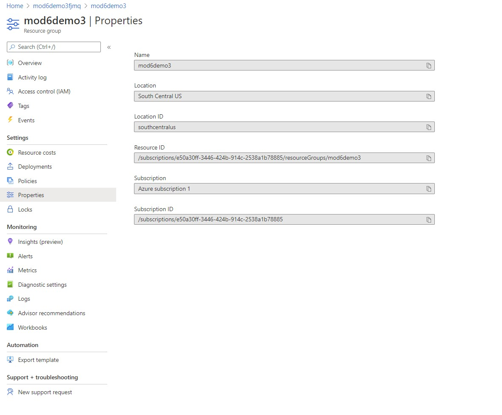
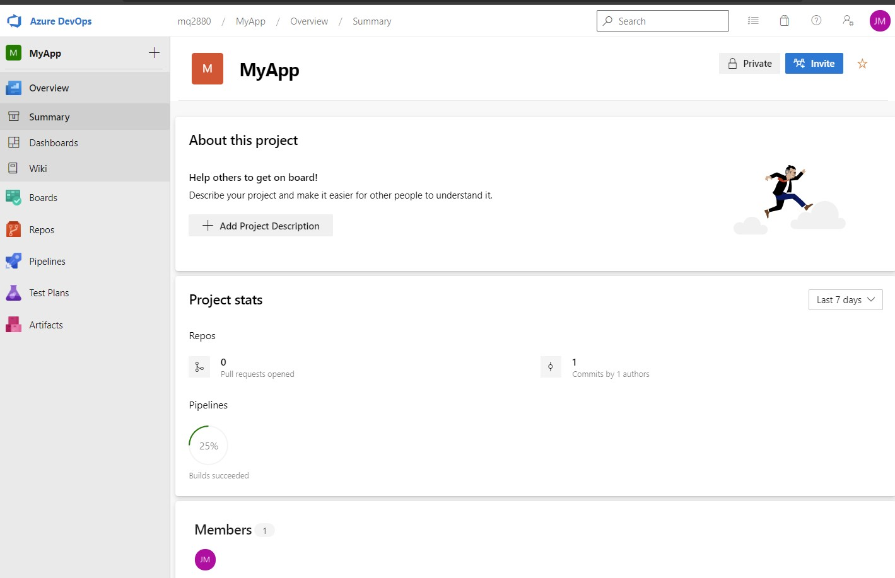
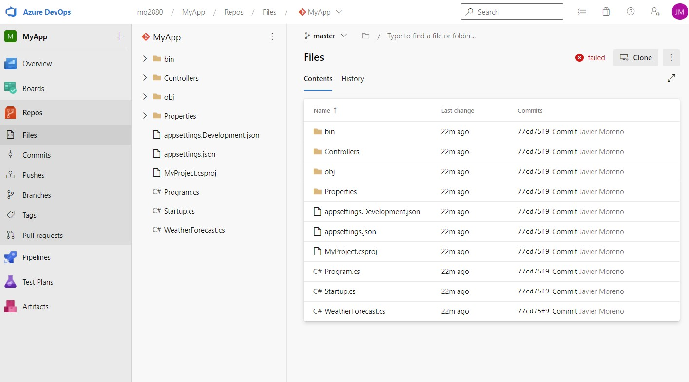
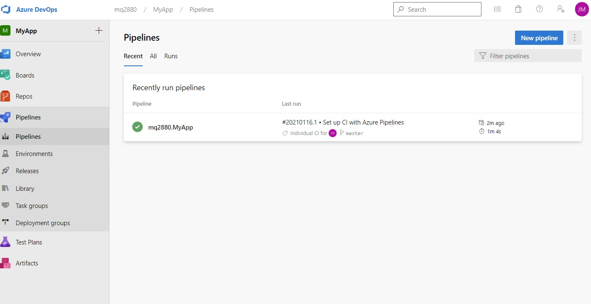

# Module 6: Deploying and Managing Services

# Lesson 3: Continuous Delivery with Microsoft Visual Studio Team Services

### Demonstration: Continuous Delivery to Websites with Git and Visual Studio Team Services

- Creamos una Web App en Azure con nombre mod6demo3fjmq

- Abrimos Team Services
- Creamos un nuevo proyecto que le llamaremos MyApp

- Creamos una nueva repo

- Creamos una pipeline
- 

- Comprobamos